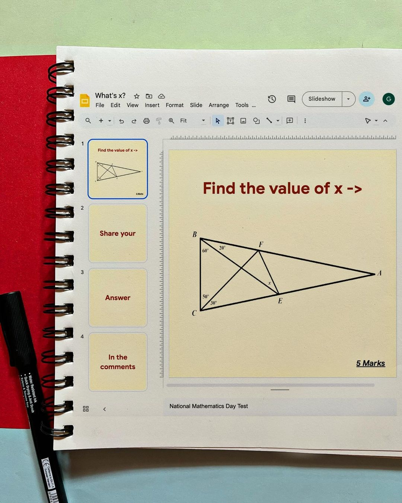
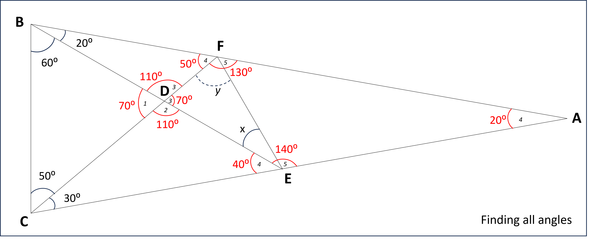
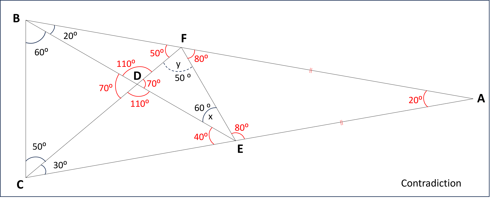

# Triangle problem from [Google India](https://www.instagram.com/googleindia/)


## Index
1. [Problem Definition](#problem-definition)
2. [Solution](#solution)


## Problem Definition

Source: [Google India](https://www.instagram.com/p/C1JIxZCp_jL/)

From the given triangle, find the value of x.

Jump to: [Index](#index), [Solution](#solution)

## Solution
Jump to: [Index](#index), [Actual Solution](#2-final-solution)
### 1. Initial attempt - Through finding all internal angles [(Contradiction)](#contradiction-case)

The annotation within the found angles (numbered 1-5) are the order in which they are calculated
1. Sum of internal angles in triangle = ```180°```.
2. Angles on straight line sum to ```180°```.
3. Opposite angles are equal
4. Sum of internal angles in triangle = ```180°```.
5. Angles on straight line sum to ```180°```.

#### Result
At the end of all these steps we see:
- Angle ∠DFE is denoted by ```y``` for convenience.
- No equation that can result in the value of x simply by using angles.
- We only know that ```x + y = 110``` and any combination would hold true.
- However, that can result in the an overall invalid shape of the triangle.
- Forexample take the following example

#### Contradiction Case
Consider ```x = 60``` and ```y = 50```.

1. All internal angles are now satisfied and individual internal triangles seem valid.
2. With this ```∠EFA = ∠FEA = 80°``` which implies that △AFE is isoceles and ```AF = AE```
3. We also have ```∠CBA = ∠ BCA = 80°``` which implies that △ABC is isoceles and ```AB = AC```. 
4. Points 3 and 4 also suggest that ```BF = CE```.
5. As ```∠BFC = ∠BCF```, △BCF is isoceles and ```BF = BC```.
6. Hence we now have ```BF = BE = BC``` and stating that △BCE is also isoceles which is ```False```.

There are multiple ways to show multiple possible contradictions for any invalid example.

### 2. Final Solution
- The [first solution](#1-initial-attempt---through-finding-all-internal-angles) shows that the solution for the value of $x cannot be found simply by angles and sides of the triangle must be considered.
- However, knowing that a triangle can be scaled easily by maintaining the angles means that a relative scale must be used to find sides in the triangles. Using ratio and relative distances, we can use them to then find the value of x.
- ```Sine Rule``` may be used to establish relation between sides and angles.

##### **Sine Rule →** ${a \over \sin A} = {b \over \sin B} = {c \over \sin C}$

```math
x = {-b \pm \sqrt{b^2-4ac} \over 2a} 
```